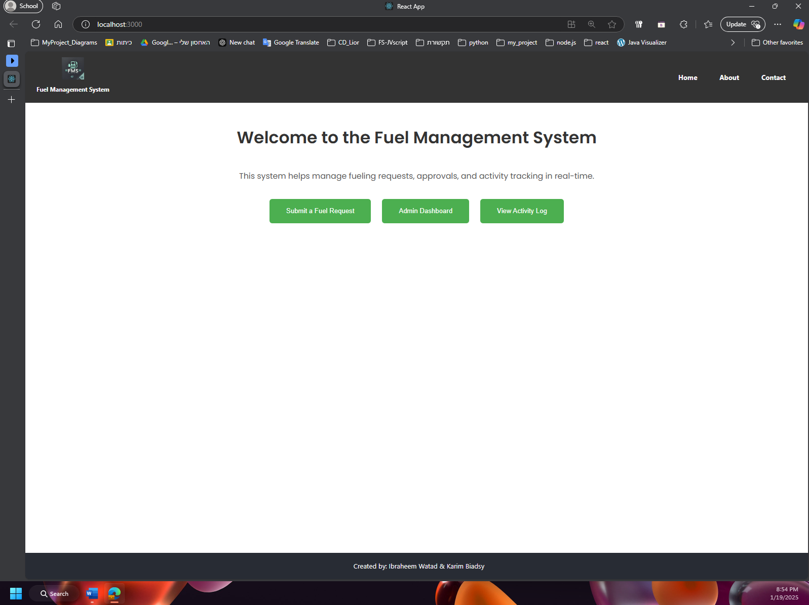
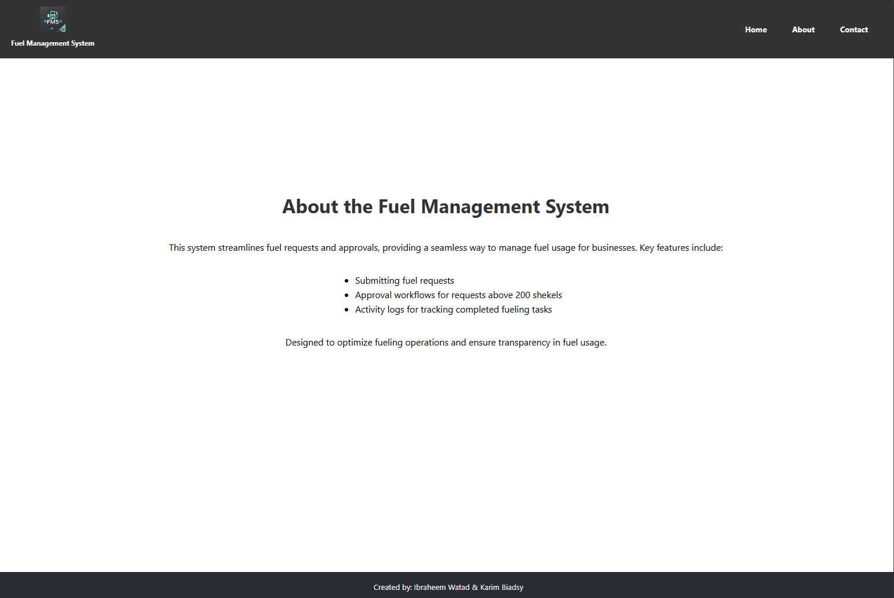
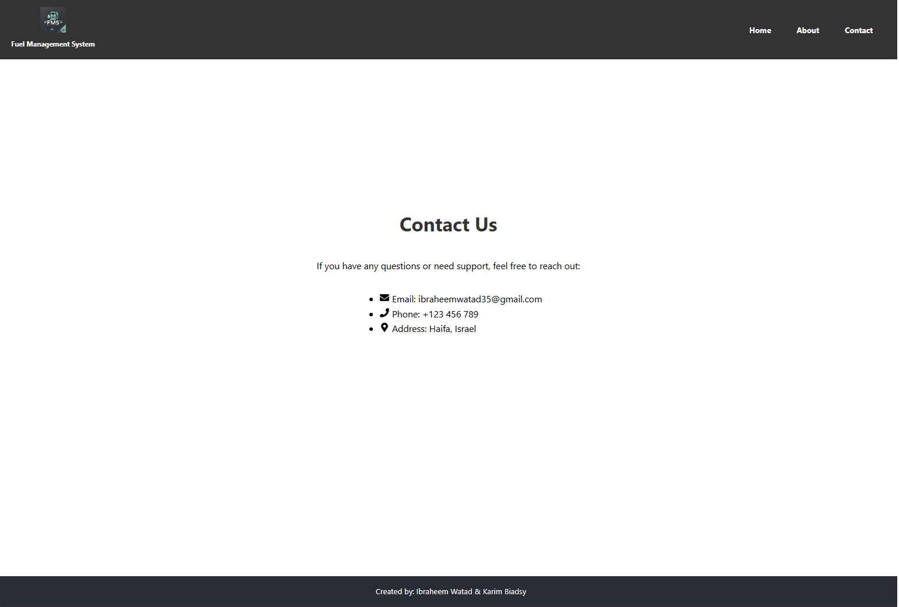
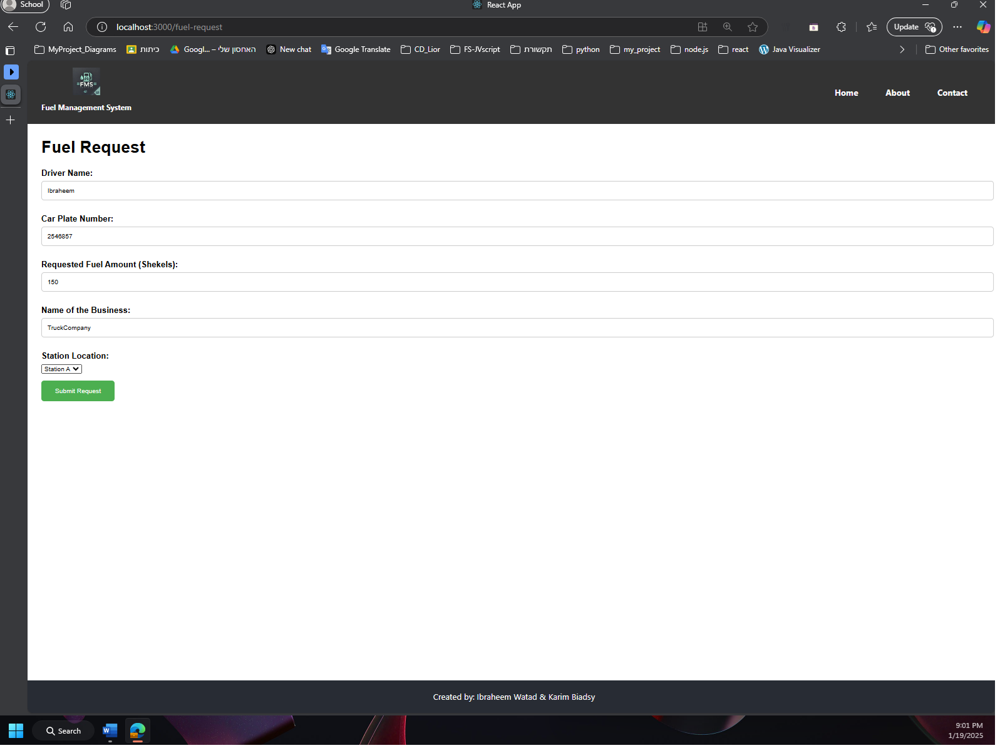
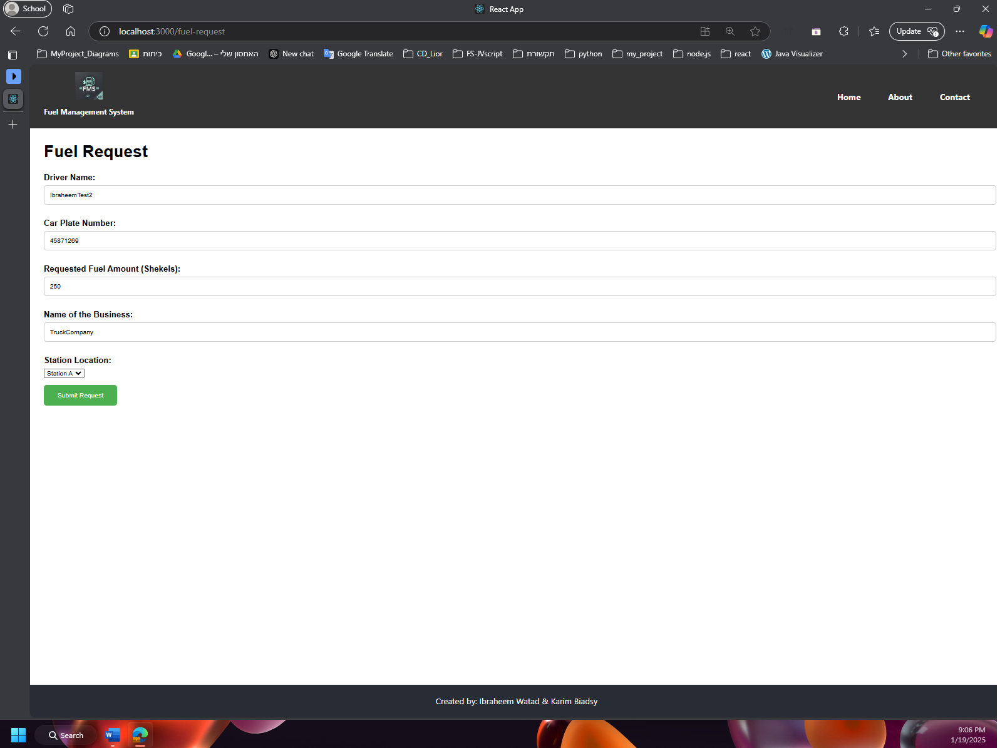
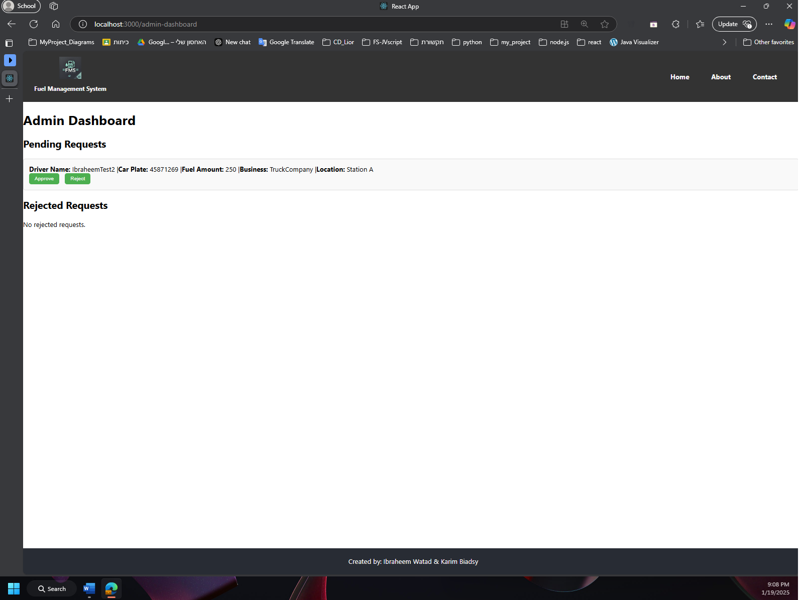
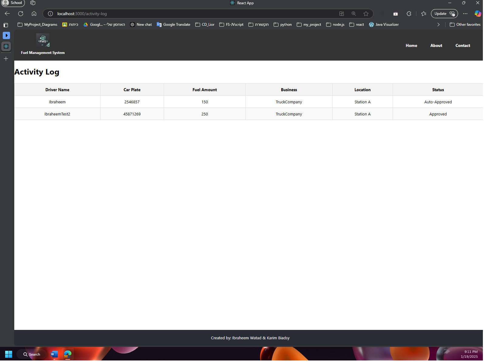

# Fuel Management System

The **Fuel Management System** is to streamline fuel requests and approvals for efficient operations. This system allows users to submit fuel requests, admins to manage approvals for requests exceeding predefined thresholds, and tracks all actions in real-time via an activity log.

---

## Features

### 🚗 Submit Requests

- Users can submit fuel requests by providing:
  - Driver name
  - Car plate number
  - Requested fuel amount
  - Business name
  - Location
- Requests are handled based on their fuel amount:
  - **Requests under 200 shekels** are auto-approved and logged directly in the activity log.
  - **Requests over 200 shekels** require admin approval and appear in the admin dashboard for further action.

### 🛠️ Admin Dashboard

- Admins have access to a dedicated dashboard to:
  - Approve or reject fuel requests exceeding 200 shekels.
  - View and manage rejected requests in a separate list.

### 📋 Activity Log

- A centralized page for tracking all actions related to fuel requests:
  - Displays details of approved and completed requests, including:
    - Driver name
    - Car plate number
    - Fuel amount
    - Business name
    - Location
    - Status (auto-approved/admin-approved)

---

## How It Works

1. **Requests <200 Shekels**:

   - Automatically approved without admin intervention.
   - Directly added to the activity log.

2. **Requests >200 Shekels**:

   - Appear in the admin dashboard for review.
   - Admins can either approve or reject these requests.

3. **Admin Actions**:
   - Approved requests are added to the activity log.
   - Rejected requests are moved to a separate rejected list in the admin dashboard.

---

## Screenshots

- **Home Page**:  
  

- **About Page**:  
  

- **Contact Page**:  
  

Here are some screenshots demonstrating key functionalities:

### 1. Auto-Approved Request (<200 Shekels)

- A request for under 200 shekels is automatically approved.
- Displays the success message and the request appearing in the activity log.

### 2. Pending Request (>200 Shekels)

- A request for over 200 shekels appears in the admin dashboard with a pending status.
- Highlights options for the admin to approve or reject the request.

### 3. Admin Dashboard with Pending Request

- The admin dashboard shows a pending request that requires review.
- Demonstrates admin actions for approving or rejecting requests.

### 4. Activity Log

- The activity log displays both auto-approved requests (<200 shekels) and admin-approved requests (>200 shekels).
- Includes detailed information such as driver name, fuel amount, business name, location, and status.

---

## Additional Notes

- Requests under 200 shekels are automatically approved to optimize workflow and save admin effort.
- Admins play a crucial role in reviewing and handling higher-value fuel requests to ensure proper oversight.
- Activity logs provide full transparency and accountability, with detailed tracking of all actions.

---
